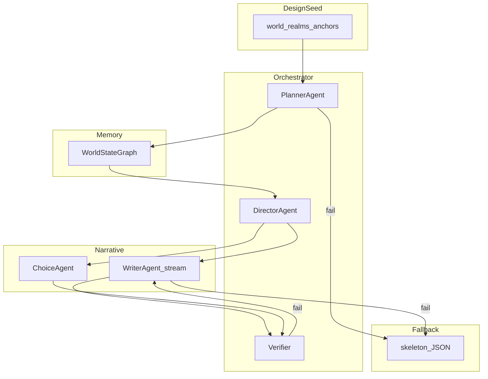

# AI 叙事引擎 v2 实施计划

## 背景与目标

- **现状**：`[game/src/game/aiEngine/index.ts](d:/projects/AnotherHistory/game/src/game/aiEngine/index.ts)` 在固定骨架 `[Node](d:/projects/AnotherHistory/game/src/game/types.ts)` 上润色叙事；`[choices.ts](d:/projects/AnotherHistory/game/src/game/aiEngine/prompts/choices.ts)` 要求 `next` 必须来自骨架；`[narrativeContext.ts](d:/projects/AnotherHistory/game/src/game/narrativeContext.ts)` 为扁平事实窗口。
- **目标**：策划输入缩为 **DesignSeed**（世界观、界主题、关键锚点）；**首次入界 / 新游戏 / 二周目** 重置或差异化 **StoryOutline**；每步由 **Director** 出指令，**Writer** 写正文（可流式），**Choice** 可生成结构与后果；**World State Graph** 维持草蛇灰线与一致性；**骨架 JSON 全程保留作降级**。
- **你已选**：完整实施范围；骨架降级；各 Agent 模型可配置；仅 Writer 流式。

## 架构总览

## 阶段划分

### P0 基础设施

| 项                                                                      | 说明                                                                                                                                                                        |
| ---------------------------------------------------------------------- | ------------------------------------------------------------------------------------------------------------------------------------------------------------------------- |
| `[chat.ts](d:/projects/AnotherHistory/game/src/game/aiEngine/chat.ts)` | 增加 `model` 参数（按 Agent 角色从配置读取）；新增 `chatStream` 或 `fetch` + SSE 解析，供 Writer 逐段回调；保留现有重试与超时。                                                                                |
| 配置                                                                     | `[getApiKey](d:/projects/AnotherHistory/game/src/config)` 旁或新 `aiModels.ts`：`VITE_AI_MODEL_PLANNER` / `DIRECTOR` / `WRITER` / `CHOICE` / `VERIFIER` 等，缺省回退 `gpt-4o-mini`。 |
| DesignSeed                                                             | 新类型（可放 `types.ts` 或 `designSeed.ts`）+ `public/data/design-seed.json`（或从现有 `总设定` 派生脚本）；运行时 `fetch` 与 skeleton 并行加载。                                                        |

### P1 记忆与上下文

| 项               | 说明                                                                                                                  |
| --------------- | ------------------------------------------------------------------------------------------------------------------- |
| WorldStateGraph | 新模块：`entities`、`events[]`（每步摘要）、可选 `relations`；API：`appendEvent`、`summaryForPrompt(tier)`、`salience` 或固定窗口。         |
| contextAssembly | 组装 L0 世界规则、L1 outline 摘要、L2 近期事件、L3 相关实体、L4 三相害物证线索、L5 `NodeDirective`；输出给 `buildNarrativeUserPrompt` 或新 prompt 模板。 |
| 兼容              | 保留 `NarrativeContextManager` 作过渡，或将其事实同步进 Graph 的 `events`。                                                         |

### P2 编排 Agent

| 项             | 说明                                                                                                                                                                     |
| ------------- | ---------------------------------------------------------------------------------------------------------------------------------------------------------------------- |
| PlannerAgent  | 输入：DesignSeed + 当前 `realmId` + 可选上周目 `PlaythroughRecord` 摘要；输出：`StoryOutline`（`beats[]`: id, type, summary, anchorRef, tension）；**仅进界成功且新周目/二周目时调用一次**；JSON schema 校验。 |
| DirectorAgent | 输入：当前 beat、Graph 摘要、玩家状态；输出：`NodeDirective`（scene_setting, mood, plot_advancement, choices_hint, foreshadowing, callback, hai_effects 文本）。                             |
| 失败            | Planner 失败 → 不改 `GameState` 遍历方式，继续用骨架 `entry_node` 与 `next`。                                                                                                          |

### P3 执行层与动态图

| 项           | 说明                                                                                                                                                                                                              |
| ----------- | --------------------------------------------------------------------------------------------------------------------------------------------------------------------------------------------------------------- |
| WriterAgent | 复用 `[narrative.ts](d:/projects/AnotherHistory/game/src/game/aiEngine/prompts/narrative.ts)` 规则（具体物象、禁忌、plot 关键词）；输入改为主任 `NodeDirective` + 组装上下文；接流式 UI。                                                         |
| ChoiceAgent | 扩展：允许输出 `next` 为 **beat_id** 或 **动态 node_id**（运行时在内存 `Map` 注册临时 `Node`）；或先实现「beat 索引 → 预生成下一 `Node` 草稿」再统一 `applyChoice`。                                                                                       |
| Verifier    | 复用 `[violatesTaboo](d:/projects/AnotherHistory/game/src/game/state.ts)`、`[narrativeMatchesPlotGuide](d:/projects/AnotherHistory/game/src/game/aiEngine/prompts/narrative.ts)`；可选：因果检查（事件 ID 是否存在）用规则；必要时单次 LLM。 |
| GameState   | `[getCurrentNode](d:/projects/AnotherHistory/game/src/game/state.ts)` 需能解析 **动态节点**：例如在 `runtimeNodes: Map<string, Node>` 中查找，找不到再查 `skeleton`；`applyChoice` 在动态模式下根据 `next` 生成或拉取下一节点。                         |

### P4 存档与 App 集成

| 项            | 说明                                                                                                                                                                                  |
| ------------ | ----------------------------------------------------------------------------------------------------------------------------------------------------------------------------------- |
| Save V3      | `[save.ts](d:/projects/AnotherHistory/game/src/game/save.ts)`：`SAVE_VERSION = 3`，增加 `storyOutline?`、`worldGraphSnapshot?`、`engineMode`（`dynamic`                                    |
| restore      | `[restoreGameState](d:/projects/AnotherHistory/game/src/game/save.ts)` 恢复 Graph 与 outline，重建 `runtimeNodes` 或清空由下一拍重新生成（需文档化策略）。                                                    |
| App          | `[App.tsx](d:/projects/AnotherHistory/game/src/App.tsx)`：编排调用顺序（Planner → Director → Writer 流式 → Choice）；缓存 key 从纯 `node_id` 扩展为 `node_id + beatRevision`；失败分支切骨架并 `setEngineMode`。 |
| NarrativeBox | 支持 `onStreamChunk` 或受控 `streamingText` prop（仅 Writer）。                                                                                                                              |

### P5 测试与文档

- 扩展 `[ai-regression.mjs](d:/projects/AnotherHistory/game/scripts/ai-regression.mjs)`：Graph 摘要、JSON schema 样例（不调用真实 API 的可选 fixture）。
- 更新 `[TODO.md](d:/projects/AnotherHistory/TODO.md)`、`[TechnicalFrame.md](d:/projects/AnotherHistory/TechnicalFrame.md)` 中 AI 引擎小节。

## 风险与约束

- **成本**：每步可能 2–3 次 LLM；Planner 每界一次；可通过配置把 Planner 指向更强模型、其余 mini。
- **一致性**：动态 `next` 必须与 `StoryOutline` 或 Verifier 对齐，否则易出现死节点；必须有 **超时/解析失败 → 骨架** 路径。
- **node_id 全局唯一**：`[findNode](d:/projects/AnotherHistory/game/src/game/skeleton.ts)` 跨 realm 扫描；动态节点建议前缀 `dyn`_ + uuid 避免与骨架冲突。

## 验收标准（建议）

1. 开游戏：无 Key 或 API 全失败时，行为与当前骨架版一致。
2. 有 Key + dynamic：进界生成 outline 并至少完成 3 步抉择，存档再读档后状态与叙事不断裂。
3. Writer：正文可流式显示；其他 Agent 仍非流式。
4. 二周目（同槽或新游戏+周目标记）：Planner 输入含上周目摘要时，outline 与首局不完全相同（可用 prompt 约束 + 人工抽检）。

